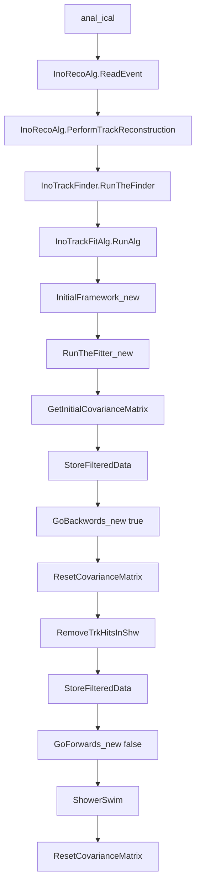

# mIcal reconstruction : Kalman

This code is for Kalman based reconstruction of digi files generated by `mIcal_mc`.

The code is tested for `root6.20.04`, `clhep2404` and `geant4.10.04.p03`.

The field file is `B_mical_hist.root`, the file name is hard-coded in `src/FieldPropagator.cc`. The field map could be scaled down. Please look for `fieldxin->Scale(` in the same file.


*Warning:*
- The code has memory leakage. It may overflow memory. I do not recommend it for running more than 1M events.
- Consult `batch_execute` to avoid the scenario.

The name of the geometry file `geo_mical_world.gdml` is hard-coded in `src/anal_ical.cc`.

Please copy the file from `mIcal_mc` if running for the first time.

Source in sim01: `source env.sh`

Requirement only once:
```
rm src/Hitsdict.cc
rm src/HitPosdict.cc
rm src/HitPosdict_rdict.pcm
rm src/Hitsdict_rdict.pcm
cd inc
rootcint ../src/HitPosdict.cc -c HitPos.h
rootcint ../src/Hitsdict.cc -c Hits.h
cd ..
```

Compile: `mkdir -p build && cd build && cmake3 .. && make -j 4 && cd ..`

Create necessary directories in needed: `simdata`, `recodata`, `digidata`, etc.

Run: `./anal_ical test.log 1 0.1 1 1000` where `test.log` contains the list of input files and for the other arguments, please constult with `src/anal_ical.cc`.

InputOutput:
```
0: SIM  -> DIGI
1: DIGI -> RECO
2: DATA -> RECO
```

Format of `test.log`: <filename><no of events><start event no>

*Warning:*
- For `SIM to DIGI`, please check the `mIcal_mc`. The colleted file and `Cal0SD` has to be updated. 
- For `DATA to RECO`, please check the input tree if needed. 
  
  ## Tracking flow


  
## Backup
  In RunAlg
  - fFinderTrack is looped over ptrackCollection->InoTrack_list L154
  - fTrackCand is set to ptrackCollection->InoTrack_list[itrk]  L161
  - InitialFramework_new -> 216
    - TrkClustsData and InitTrkClustData are set here from fFinderTrack L556
  - RunTheFitter_new -> L221
    - GetInitialCovarianceMatrix(true) L683
    - StoreFilteredData(MaxPlane)      L894
    - GoBackwards_new(false)           L898
      - Loop over all clusters in track L4782
      - Swim_new(StateVector, Prediction, plane, nextplane, false, &ds, &drange) L4818
      - GetCombiPropagator(i,NewPlane,true,&ds_gpl, &drange)                     L4710
      - GetNoiseMatrix(i,NewPlane)
      - ExtrapCovMatrix()
      - CalcKalmanGain(NewPlane)
	    - UpdateStateVector(i,NewPlane,true)
      - UpdateCovMatrix();
      - MoveArrays();
      - StoreFilteredData(NewPlane);          L4725  
    - ResetCovarianceMatrix()
    - FilteredData[i].clear()
    - StoreFilteredData(MinPlane)
    - GoForwards_new(false)
    - ResetCovarianceMatrix()
    - Iteration L932
      - GoBackwards_new(true)
      - ResetCovarianceMatrix()
      - StoreFilteredData(MinPlane)
      - GoForwards_new(false)
      - ResetCovarianceMatrix() L1037
      - Swim(StateVector, Prediction, MaxPlane, loc_zend, GoForward) and then break
    - FillGapsInTrack()
    - SetTrackProperties(Prediction)
